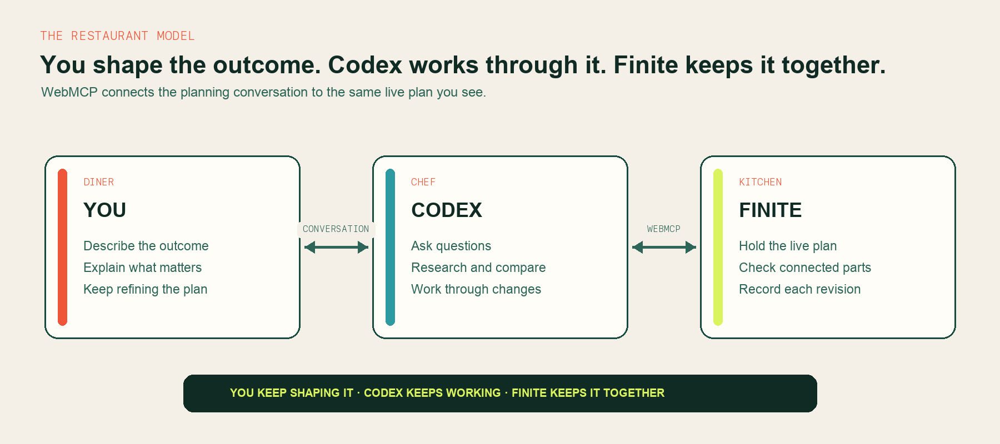
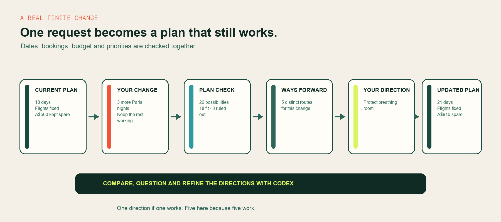
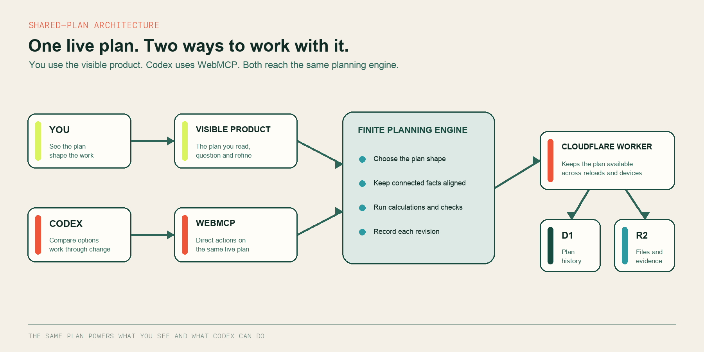

<h1 align="center">
  
  
</h1>

<p align="center"><strong>Change your plans without rebuilding them.</strong></p>

<p align="center">
  Finite is a planning partner for trips, renovations, events, work and anything else with connected parts. Tell Codex what changed. Finite works through the affected dates, costs, commitments and dependencies, then brings back the distinct ways forward that still fit.
</p>

<p align="center">
  <a href="https://finite.bharthamk.chatgpt.site/?start=spotlight-active&tour=spotlight&plan=1&fresh=1"><strong>Try the two-minute demo</strong></a>
  &nbsp;·&nbsp;
  <a href="https://finite.bharthamk.chatgpt.site/"><strong>Open Finite</strong></a>
</p>

<p align="center">
  <sub>Judging Finite? <a href="./submission/JUDGE_TESTING_INSTRUCTIONS.md">Read the testing guide</a>.</sub>
</p>

<p align="center">
  <a href="https://github.com/bharthamk/finite/actions/workflows/ci.yml"></a>
  
  
  <a href="./LICENSE"></a>
</p>


## See one change worked through across the whole plan

Your 18-day trip is planned. The international flights cannot move, and you
want to keep at least A$500 spare. Then you decide to stay three more nights in
Paris.

In an ordinary planner, you now have to revisit every date, stay, journey and
budget line yourself. A chat assistant can suggest an answer, but you still
have to transfer it into the plan and check what else broke.

Finite checks the whole trip together. It rules out changes that break the
flights or the spending floor, then brings back each distinct way forward that
fits, with its trade-offs made clear. You choose **Protect breathing room**. The trip
becomes 21 days, the flights stay fixed, and A$910 remains spare.

Instead of rebuilding the plan, you keep shaping it with Codex from the same
live picture.


## You should be the diner, not the kitchen staff

Most planning software makes you run the kitchen. It gives you forms, tables
and controls, then leaves you to research, recalculate and keep every connected
part in sync.

Finite lets you stay focused on the outcome. You tell Codex what you want, what
matters and what has changed. Codex works through the plan with you: asking
questions, researching, comparing possibilities and adapting as you refine the
brief. Finite is the kitchen behind that collaboration, keeping the dates,
costs, dependencies, commitments and constraints working together.

WebMCP is the direct connection between Codex and that kitchen. It lets Codex
work with the same live plan you see, use Finite to evaluate real changes and
continue from the exact result. The conversation and the planning software
become one workflow.



## One system, shaped around the work

Finite changes shape around the work. A trip becomes a route, calendar,
bookings and budget. A renovation becomes phases,
dependencies, costs and handover. An event becomes a run of show, capacity and
commitments. An interview becomes evidence, questions and rehearsal. A dinner
becomes guests, dietary needs, courses and timing.


Underneath, Finite uses one planning model for connected facts, constraints,
choices and revisions. On screen, each plan gets the structure and language
the work actually needs.

## Why this needs WebMCP

Without WebMCP, Codex sits outside the plan. It can suggest what to do, but you
still have to copy the answer into the planner, recheck every dependency and
keep the conversation aligned with whatever changed next.

With WebMCP, the planning conversation reaches the product itself. Codex can
read the current plan, tell Finite what changed, ask it to test the connected
consequences, compare every distinct workable direction and continue from the
chosen revision. Finite handles the calculations and connected state while you
and Codex keep working through what comes next.


The result is not just an answer at the end of a chat. It becomes the next
working state for the conversation and the product. When a direction is ready,
the person confirms it in Finite and both Codex and Finite continue from that
revision.

<details>
<summary><strong>How the WebMCP surface is built</strong></summary>

Finite keeps seven stable page tools available while the actions inside them
adapt to the current plan:

| Stable tool | What it gives Codex |
|---|---|
| `finite_webmcp_status` | Check whether the WebMCP connection is ready |
| `finite_enter_kitchen` | Read the active plan and receive the next useful planning step |
| `finite_get_capabilities` | Learn the plan's language and available work |
| `finite_open_toolset` | Open the relevant set of typed planning actions |
| `finite_invoke` | Run one selected action against the current revision |
| `finite_read_result` | Retrieve larger exact results only when they are needed |
| `finite_get_effort_receipt` | Report the work performed, failures and accepted changes |

The wrappers remain predictable for Codex while their planning actions change
with the compiled plan. A trip, renovation and event therefore expose different
working vocabulary through the same durable connection.

</details>

## How Finite works through a real change



The public Spotlight starts with an 18-day trip. The international flights are
fixed and at least A$500 must remain spare. You ask to add three Paris nights
without losing either condition.

Finite checks more than the Paris row. It tests 26 connected combinations
across dates, stays, transport and budget. Eighteen still fit, eight break the
plan, and five meaningfully different directions remain. You and Codex can
compare, question and refine them before carrying **Protect breathing room**
into the plan. The result is a 21-day trip with the flights fixed and A$910
spare.


The five directions exist because five genuinely different routes work for
this change. If only one direction works, Finite returns one.

<details>
<summary><strong>Engineering proof: the updated plan survives reload</strong></summary>


</details>

## One live plan, two ways to work with it

Finite keeps one live plan shared by the visible product and Codex. You work
with it through the interface. Codex works with it through WebMCP. Both reach
the same planning engine, so dates, costs, constraints, choices and revisions
stay aligned.



Inside the browser, Finite shapes the workspace around the work, runs the
calculations and checks each change against the connected plan. A Cloudflare
Worker stores plan history in D1 and files and evidence in R2, so the same plan
survives reloads and can continue across devices.

[Read the complete engineering architecture](./docs/ARCHITECTURE.md)

## What you can do today

The public release covers the full life of a plan, from the first outcome to
day-to-day work, real-world change and wrap-up.

| When you need to... | Finite lets you... |
|---|---|
| **Turn an outcome into a working plan** | Describe what you want in ordinary language or enter it yourself. Finite builds the workspace around the work, whether it is a trip, renovation, event or something custom. |
| **Plan with Codex inside the product** | Let Codex read the current plan through WebMCP, work with its exact dates, costs and constraints, add researched evidence and continue from the live result. |
| **Respond when reality changes** | Bring in a new cost, delay or change of intent. Finite checks the connected plan and returns however many meaningfully different workable directions exist, with rejected routes and trade-offs visible. |
| **Carry the plan into execution** | Keep tasks, checklists, files, references, decisions and actual costs beside the plan instead of rebuilding the work in another tool. |
| **Continue and collaborate** | Return to the same plan across devices, manage multiple plans, invite others to view, suggest or edit, and publish a selected read-only view. |
| **Keep useful history** | Move through revisions with clear receipts, wrap up completed work and carry forward only the lessons you choose to retain. |

Every surface is responsive and keyboard-operable, including the browser-local
demo used in the public judge route.

## Where the engineering lives

For technical judges and contributors, the main implementation and proof
surfaces are:

| Path | Purpose |
|---|---|
| [`src/`](./src) | Visible product, adaptive workspaces, shared planning engine and WebMCP actions |
| [`worker/`](./worker) | Cloudflare APIs for plan history, collaboration, publishing and D1/R2 persistence |
| [`db/`](./db) and [`drizzle/`](./drizzle) | Durable data model and ordered migrations |
| [`tests/`](./tests) | 368 tests covering calculations, plan changes, persistence, collaboration, WebMCP and complete journeys |
| [`docs/ARCHITECTURE.md`](./docs/ARCHITECTURE.md) | End-to-end design, state transitions and data flow |
| [`docs/acceptance/`](./docs/acceptance) | Dated product and engineering acceptance records |
| [`docs/engineering/`](./docs/engineering) | Deeper technical and endurance reports |
| [`submission/`](./submission) | Judge route, project story, evidence map, screenshots, film script and storyboard |

## Run locally

Requirements: Node.js 22.13 or newer.

```bash
npm ci
npm run db:local:migrate
npm run typecheck
npm test
npm run build
npm run dev
```

Open the local URL printed by Vite. Native Chrome WebMCP testing currently
requires `chrome://flags/#enable-webmcp-testing`. A supported host will show
that Codex is connected.

Local development uses an isolated D1 database named `finite-local` and an
isolated R2 bucket. The identifiers in `wrangler.local.jsonc` are local-only.
Production uses the Sites-managed `DB` and `FILES` bindings declared in
`.openai/hosting.json`.

## Release proof

The accepted public release is **v245** with marker
`hosted-release-marker-v245`.

- **368/368** automated tests pass
- **20/20** independent hostile Spotlight kernel transactions pass
- TypeScript, production client and Worker builds pass
- Client chunk budget and submission working gate pass
- Public root, WebMCP readiness and canonical kitchen entry are verified

Read the [v245 acceptance record](./docs/acceptance/FINITE_V245_PRODUCT_ACCEPTANCE_2026-09-03.md),
[reproducible release instructions](./REPRODUCIBLE_RELEASE.md) and
[judge testing instructions](./submission/JUDGE_TESTING_INSTRUCTIONS.md).

## Product principles

Finite is built around a small set of non-negotiable rules:

1. Planning stays collaborative from the first request through the accepted revision.
2. Proposed and accepted work remain easy to distinguish.
3. Decisions that require human judgment stay with the person.
4. Every accepted transition produces a durable, inspectable receipt.
5. The plan must remain coherent when reality changes, not only when it is created.

The full product direction lives in
[PRODUCT_NORTH_STAR.md](./PRODUCT_NORTH_STAR.md) and
[ARRIVAL_AND_SURFACE_CONTINUITY.md](./ARRIVAL_AND_SURFACE_CONTINUITY.md).

## Ownership and licence

Finite is a project by [Benji Hart](https://github.com/bharthamk), created for
the WebMCP Challenge.

The source and documentation are available under the [MIT License](./LICENSE).
The Finite name, wordmark and logo identify this project. The licence grants no
trademark rights in that branding.
