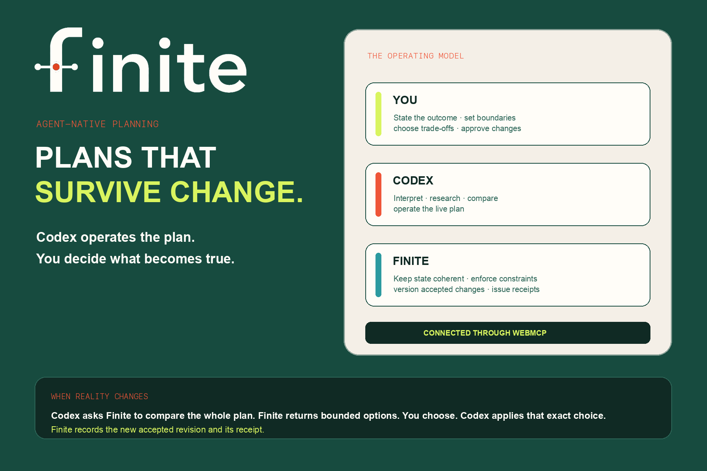
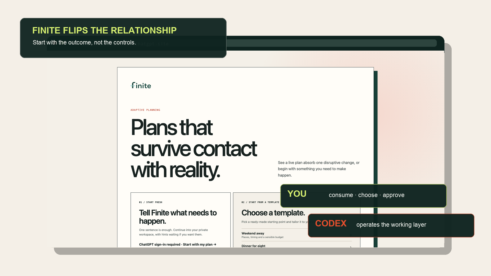
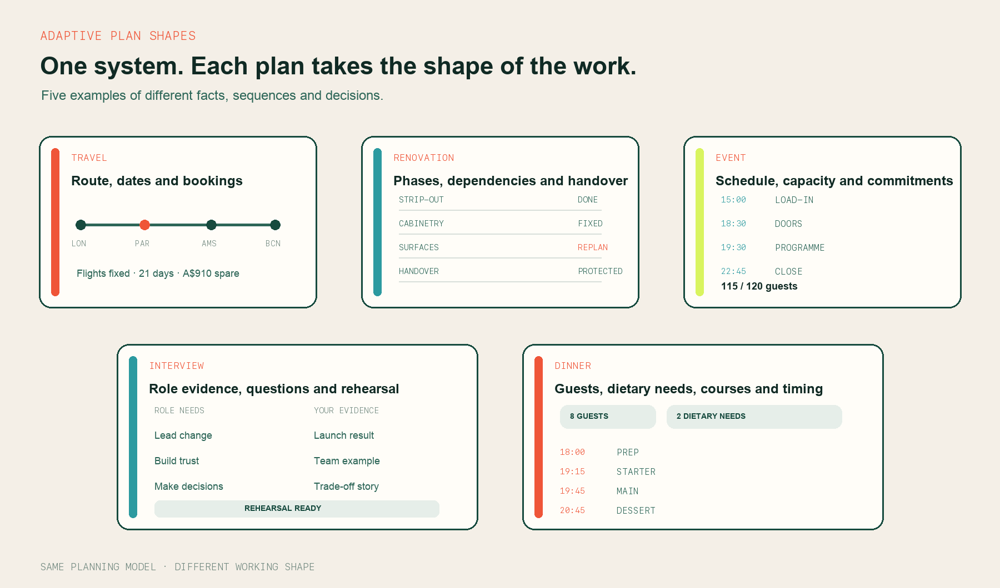
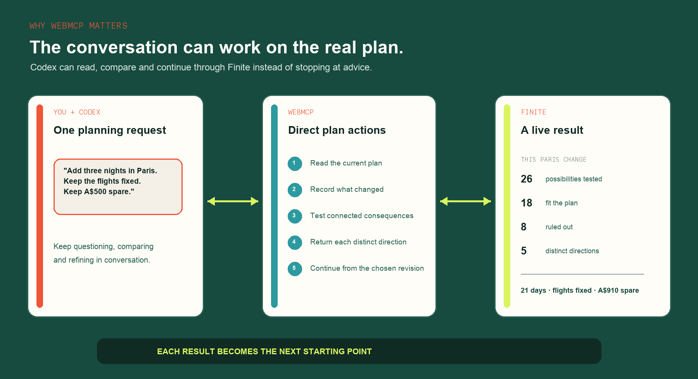
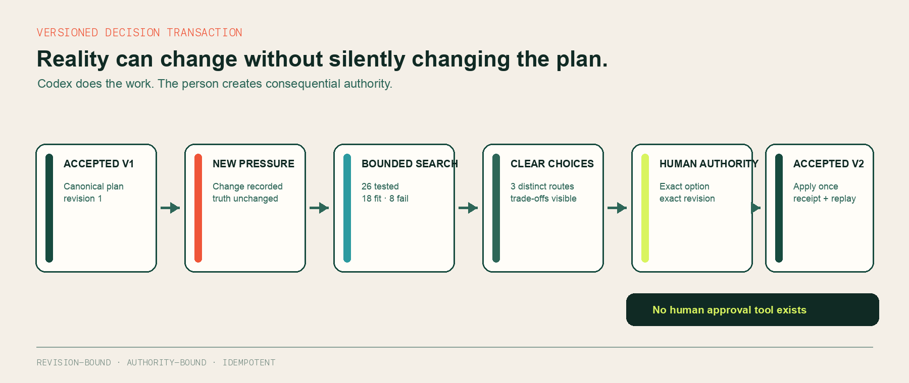
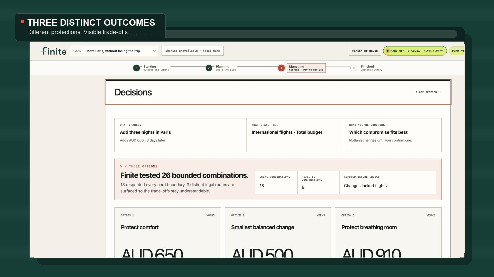
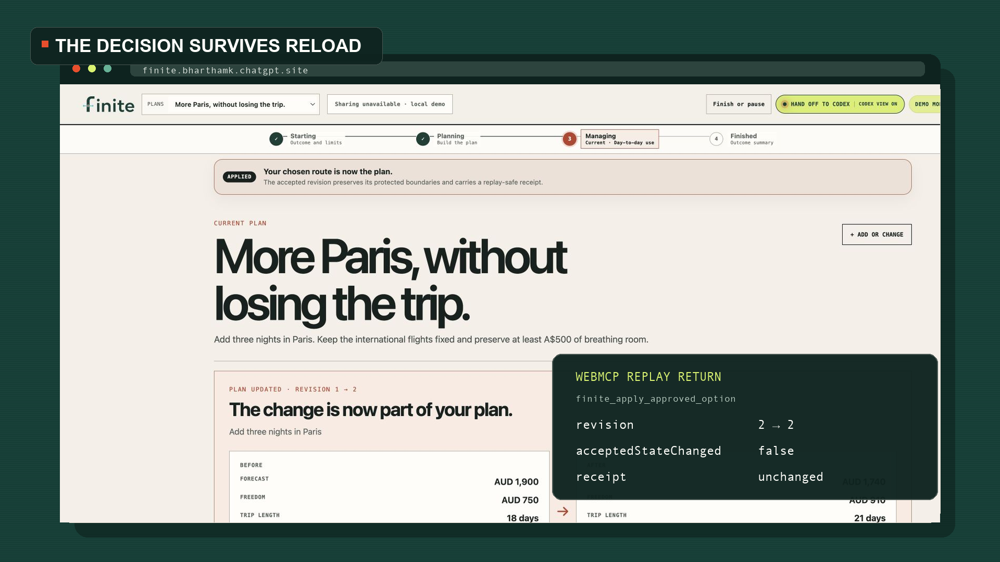
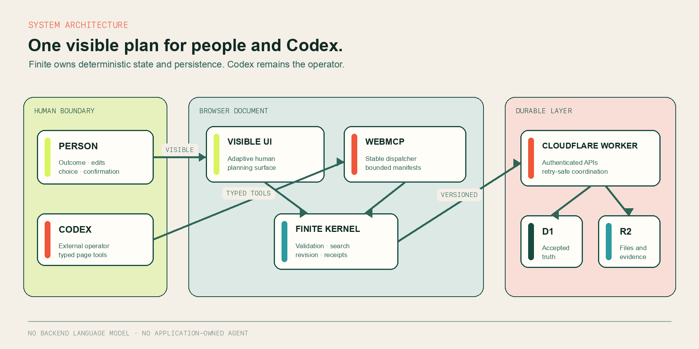

# Finite

<p align="center">
  
  
</p>

<p align="center"><strong>Plans that survive change.</strong></p>

<p align="center">
  Finite is planning software built for a person and Codex to share. You describe the outcome and set the boundaries. Codex works inside the plan through WebMCP. Finite tests every change against the whole plan and records only the exact option you approve.
</p>

<p align="center">
  <a href="https://finite.bharthamk.chatgpt.site/"><strong>Open Finite</strong></a>
  &nbsp;·&nbsp;
  <a href="https://finite.bharthamk.chatgpt.site/?start=spotlight-active&tour=spotlight&plan=1&fresh=1"><strong>Run the two-minute judge Spotlight</strong></a>
  &nbsp;·&nbsp;
  <a href="./submission/JUDGE_TESTING_INSTRUCTIONS.md"><strong>Testing guide</strong></a>
</p>

<p align="center">
  <a href="https://github.com/bharthamk/finite/actions/workflows/ci.yml"></a>
  
  
  <a href="./LICENSE"></a>
</p>



## The product in one minute

Most planning software gives people forms, dashboards and workflows, then asks
them to do the operational work. Finite changes the division of labour:

| Role | Restaurant model | What happens in Finite |
|---|---|---|
| **You** | The diner | State the outcome, add judgment, choose trade-offs and grant exact authority |
| **Codex** | The chef | Interpret, research, compare, prepare and operate the plan |
| **Finite** | The kitchen and service | Keep facts, constraints, arithmetic, evidence, revisions and receipts coherent |
| **WebMCP** | The operating seam | Let Codex work inside the same live plan that you can see |

The result is neither a chat-generated itinerary nor a generic task dashboard.
It is a versioned planning system where new information can create pressure
without silently becoming accepted truth.



## One system, many kinds of plan

Finite compiles one planning grammar into surfaces that fit the work. A trip
uses dates, places and transport. A renovation uses phases, dependencies and
handover. An event uses a run of show, capacity and commitments. Interview
preparation and dinner planning use different measures again.



These are not renamed copies of a single dashboard. The time model, measures,
entities, actions and decision surface change with the planning contract.

## Why WebMCP is essential

WebMCP turns the visible page into a typed operating environment. Codex reads
the accepted plan, opens a bounded action group, invokes exact semantic actions
and receives compact, durable results. It does not need a copied chat replica or
pixel-level automation.



Finite keeps seven stable page tools discoverable for the document lifetime:

| Stable tool | Responsibility |
|---|---|
| `finite_webmcp_status` | Report bootstrap readiness without exposing plan state |
| `finite_enter_kitchen` | Return canonical identity, accepted state and one grounded next action |
| `finite_get_capabilities` | Describe the active contract, vocabulary and authority law |
| `finite_open_toolset` | Open one bounded semantic action manifest |
| `finite_invoke` | Execute one exact action after revalidating revision, evidence and authority |
| `finite_read_result` | Recover exact fields from a content-addressed result when needed |
| `finite_get_effort_receipt` | Report tool effort, failures, boundaries and accepted mutations |

Human confirmation creators are deliberately absent from that tool surface.
Codex can do the work and prepare a choice. Only the person can create the
authority required for a consequential transition.

## The decision transaction



The public Spotlight makes that flow concrete. An 18-day trip has fixed flights
and must retain at least A$500. Reality adds three Paris nights. Finite tests 26
bounded combinations, keeps 18 that fit, rejects 8 and returns 3 meaningfully
different routes. The person selects one. Codex applies only that exact approved
route. Revision 1 becomes revision 2, Paris moves from 4 to 7 nights, and A$910
remains free.





## System architecture

Finite has no backend language model and no application-owned agent. Codex is
the operator. Finite is the deterministic product and persistence layer.



The browser runtime compiles adaptive surfaces, validates typed actions and
keeps proposed work separate from accepted state. The Worker owns authenticated
durability across D1 and R2. Every accepted mutation is revision-bound,
authority-bound and idempotent.

[Read the complete engineering architecture](./docs/ARCHITECTURE.md)

## What is implemented

- Arrival-first planning from ordinary language or structured manual input
- Adaptive travel, renovation, event and general-plan workspaces
- Exact integer-money conservation, locks, constraints and typed relationships
- Deterministic option search with visible rejected and accepted combinations
- Human-bound approval, immutable revisions and replay-safe receipts
- Planning-to-Managing progression with real-world change handling
- Evidence, attachments, tasks, files, decisions and completion learning
- Multi-plan catalogues, cross-device restore and role-bounded collaboration
- Published read-only views and isolated browser-local demonstrations
- Responsive, keyboard-operable human surfaces

## Repository map

| Path | Purpose |
|---|---|
| [`src/`](./src) | Browser product, adaptive compiler, planning kernel and WebMCP registry |
| [`worker/`](./worker) | Cloudflare Worker, authenticated APIs and D1/R2 coordination |
| [`db/`](./db) and [`drizzle/`](./drizzle) | Durable schema and ordered migrations |
| [`tests/`](./tests) | Kernel, authority, persistence, WebMCP and full-journey regression coverage |
| [`docs/architecture`](./docs/ARCHITECTURE.md) | System boundaries, state transitions and data flow |
| [`docs/acceptance/`](./docs/acceptance) | Dated product and engineering acceptance records |
| [`docs/engineering/`](./docs/engineering) | Deeper design and endurance reports |
| [`submission/`](./submission) | Judge route, project story, evidence map, film script and storyboard |

## Run locally

Requirements: Node.js 22.13 or newer.

```bash
npm ci
npm run db:local:migrate
npm run typecheck
npm test
npm run build
npm run dev
```

Open the local URL printed by Vite. Native Chrome WebMCP testing currently
requires `chrome://flags/#enable-webmcp-testing`. A supported host will show
that Codex is connected.

Local development uses an isolated D1 database named `finite-local` and an
isolated R2 bucket. The identifiers in `wrangler.local.jsonc` are local-only.
Production uses the Sites-managed `DB` and `FILES` bindings declared in
`.openai/hosting.json`.

## Release proof

The accepted public release is **v242** with marker
`hosted-release-marker-v242`.

- **367/367** automated tests pass
- **20/20** independent hostile Spotlight kernel transactions pass
- TypeScript, production client and Worker builds pass
- Client chunk budget and submission working gate pass
- Public root, WebMCP readiness and canonical kitchen entry are verified

Read the [v242 acceptance record](./docs/acceptance/FINITE_V242_PRODUCT_ACCEPTANCE_2026-09-02.md),
[reproducible release instructions](./REPRODUCIBLE_RELEASE.md) and
[judge testing instructions](./submission/JUDGE_TESTING_INSTRUCTIONS.md).

## Product principles

Finite is built around a small set of non-negotiable rules:

1. A request for change is not permission to rewrite accepted truth.
2. Proposed work remains visibly different from accepted work.
3. Consequential authority comes from the person, never from agent inference.
4. Every accepted transition produces a durable, inspectable receipt.
5. The plan must remain coherent when reality changes, not only when it is created.

The full product direction lives in
[PRODUCT_NORTH_STAR.md](./PRODUCT_NORTH_STAR.md) and
[ARRIVAL_AND_SURFACE_CONTINUITY.md](./ARRIVAL_AND_SURFACE_CONTINUITY.md).

## Ownership and licence

Finite is a project by [Benji Hart](https://github.com/bharthamk), created for
the WebMCP Challenge.

The source and documentation are available under the [MIT License](./LICENSE).
The Finite name, wordmark and logo identify this project. The licence grants no
trademark rights in that branding.
