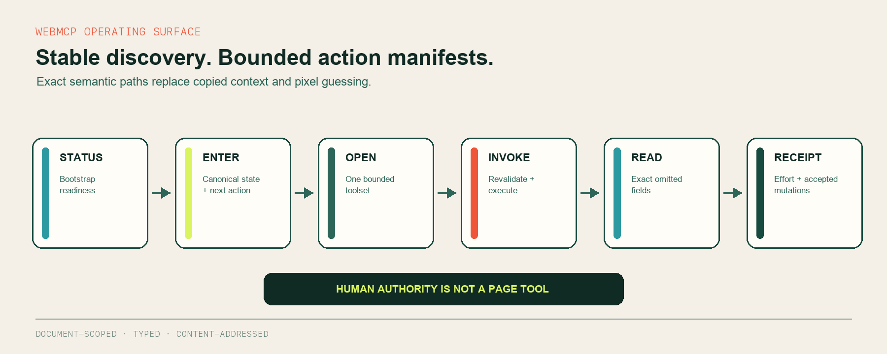
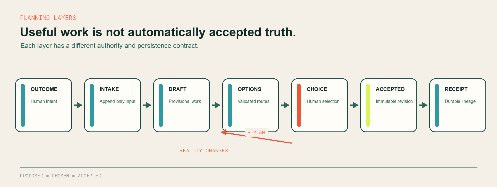
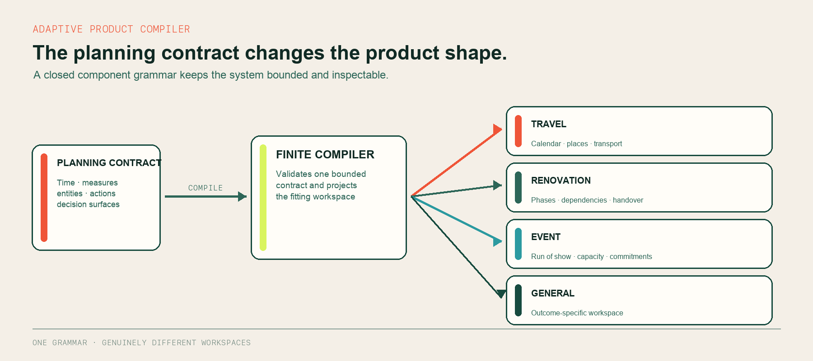

# Finite engineering architecture

This document explains how Finite lets Codex operate a live plan without giving
the agent control over human decisions or making a language model responsible
for accepted truth.

## Design boundary

Finite is a deterministic planning product. Codex is an external operator that
uses typed page tools. There is no backend language model and no hidden
application-owned agent.

The approval path enters through the visible human interface. It is not exposed
as a WebMCP capability. Apply operations require the exact approval, candidate,
revision and idempotency key generated by the accepted interaction.

## WebMCP surface

Finite registers a small stable surface, then routes work through bounded
semantic manifests.

`finite_open_toolset` returns the exact actions and schemas available for one
semantic group. `finite_invoke` accepts only an action from that open manifest
and revalidates its group, input, active revision, evidence and authority at
execution time. This keeps discovery stable while preventing an unbounded tool
catalogue from becoming the interface.

Large results are stored temporarily under a content hash. The compact response
advertises exact JSON Pointer paths, and `finite_read_result` retrieves only the
fields required for the current route. This avoids silent truncation and keeps
the operating context small.

## Accepted-state transaction

## Planning layers

Finite deliberately keeps different epistemic states apart:

- **Intake** preserves what the person actually supplied and its provenance.
- **Draft work** is editable and useful, but it is not accepted truth.
- **Options** are validated alternatives outside the plan until selected.
- **Authority** binds one exact human confirmation to one exact revision.
- **Accepted revisions** are immutable lineage points.
- **Receipts** record what changed and make retries inspectable.

## Adaptive product compiler

The browser runtime compiles plan-specific experiences from a bounded grammar.
The active planning contract determines which time model, measures, entities,
relationships, actions and decision views are valid.

The compiler uses a closed component grammar. It can change the product shape
without injecting arbitrary executable interface code.

## Persistence topology

| Layer | Responsibility |
|---|---|
| Browser runtime | Current interaction state, adaptive rendering and deterministic validation |
| D1 | Accounts, orders, plans, revisions, collaboration, decisions, receipts and learning records |
| R2 | Plan files and attachments addressed through authorised application records |
| Local demo | Isolated browser-local state that cannot write into a signed-in workspace |

Cross-store work uses retry-safe records. Accepted plan writes remain coherent
if a later optional route refresh or presentation step fails.

## Core invariants

1. Accepted state changes only through a valid transition.
2. Every mutating operation is revision-aware.
3. Consequential apply requires exact human authority.
4. Duplicate retries return the existing receipt instead of duplicating work.
5. Money uses integer minor units and conservation checks.
6. Invalid dates, negative forecasts and stale revisions fail closed.
7. Evidence is data with provenance, never executable instruction.
8. External action states remain distinct: researched, quoted, held, booked,
   paid, verified and cancelled are not interchangeable.

## Source map

| Concern | Primary source |
|---|---|
| Accepted-state law and planning transitions | [`src/kernel.ts`](../src/kernel.ts), [`src/accepted-truth.ts`](../src/accepted-truth.ts) |
| WebMCP registration, manifests and dispatch | [`src/webmcp.ts`](../src/webmcp.ts), [`src/webmcp-bootstrap.ts`](../src/webmcp-bootstrap.ts) |
| Arrival and provisional workspace | [`src/arrival.ts`](../src/arrival.ts), [`src/construction-packet.ts`](../src/construction-packet.ts) |
| Adaptive experience routing | [`src/experience-route.ts`](../src/experience-route.ts), [`src/profiles.ts`](../src/profiles.ts) |
| Browser persistence adapter | [`src/persistence.ts`](../src/persistence.ts) |
| Durable API and storage coordination | [`worker/`](../worker) |
| Relational schema and migrations | [`db/schema.ts`](../db/schema.ts), [`drizzle/`](../drizzle) |
| End-to-end and invariant proof | [`tests/`](../tests), [`docs/acceptance/`](./acceptance) |

## Verification

The accepted v245 release passes 368 automated tests, 20 hostile Spotlight
kernel transactions, TypeScript, production browser and Worker builds, client
chunk limits and the submission consistency gate.

See the [v245 product acceptance record](./acceptance/FINITE_V245_PRODUCT_ACCEPTANCE_2026-09-03.md)
and [reproducible release guide](../REPRODUCIBLE_RELEASE.md).
